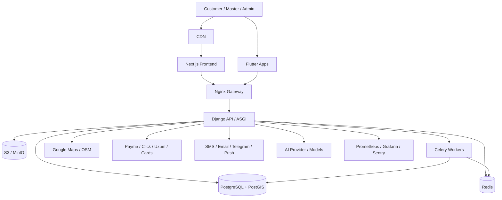

# UstaGo Enterprise Production Specification

## 1. Document Purpose

This document defines the target production architecture, functional scope, non-functional requirements, integration boundaries, delivery constraints, and acceptance criteria for the `UstaGo` super app ecosystem.

It is the canonical product and technical specification for building and operating UstaGo as an enterprise-grade marketplace and on-demand services platform in Uzbekistan.

## 2. Product Vision

UstaGo is a unified service marketplace that combines the discovery, booking, dispatch, escrow payment, messaging, support, and analytics capabilities commonly associated with platforms such as Uber, Yandex Go, Airbnb, Upwork, and Uzum.

The platform connects:

- customers who need services,
- masters (workers / service providers) who fulfill jobs,
- companies managing multiple workers,
- admins overseeing operations,
- super admins managing the full platform.

The platform must support fast service ordering, real-time location workflows, rich media requests, in-app chat, payment escrow, review systems, AI-assisted categorization and pricing, and enterprise operations tooling.

## 3. Product Surfaces

UstaGo consists of the following connected surfaces:

1. `Customer Mobile App` (Flutter)
2. `Master Mobile App` (Flutter)
3. `Web Platform` (Next.js)
4. `Admin Panel` (Next.js and/or Django Admin for operations)
5. `Super Admin Panel` (full control plane)
6. `Backend API` (Django + DRF + Channels)
7. `Real-Time Services` (WebSocket / Channels / Redis)
8. `AI Services` (classification, price estimation, recommendation, fraud detection, support)
9. `Payments & Wallets`
10. `Notifications` (push, SMS, email, Telegram)
11. `Analytics & CRM`
12. `DevOps / Monitoring / Backup`

## 4. Supported Service Domains

The system must support unlimited admin-managed categories and subcategories, including but not limited to:

### Home Services
- Plumber
- Electrician
- Welder
- AC Technician
- Refrigerator Repair
- Washing Machine Repair
- TV Repair
- Computer Repair
- CCTV Installation
- Internet Technician

### Construction
- Bricklayer
- Painter
- Tile Installer
- Roofer
- Concrete Worker
- Carpenter
- Drywall Installer

### Furniture
- Furniture Assembly
- Cabinet Maker
- Kitchen Furniture Specialist

### Cleaning
- Home Cleaning
- Office Cleaning
- Deep Cleaning

### Transport
- Loader
- Driver
- Courier

### Other Services
- Gardener
- Security Services
- Appliance Installation

## 5. Core Personas and Roles

### 5.1 Customer
Capabilities:
- registration and login,
- phone auth and OTP verification,
- social auth,
- address management,
- order creation,
- upload photos / videos / voice notes,
- map-based master discovery,
- receive offers,
- select a master,
- chat / call / video,
- track order and worker location,
- pay via supported payment methods,
- review, rate, and favorite masters,
- view order history,
- receive notifications,
- access help center and AI assistant.

### 5.2 Master
Capabilities:
- registration,
- profile creation,
- identity verification,
- face verification,
- service selection,
- pricing setup,
- service area management,
- portfolio,
- working schedule,
- online / offline availability,
- nearby order feed,
- offer submission,
- job acceptance / rejection,
- order workflow updates,
- earnings dashboard,
- wallet management,
- payout requests,
- performance analytics.

### 5.3 Company Account
Capabilities:
- corporate registration,
- employee / master management,
- multiple sub-accounts,
- corporate order workflows,
- invoice management,
- reporting and exports,
- centralized wallets / settlements.

### 5.4 Admin
Capabilities:
- user moderation,
- master approval / rejection,
- content moderation,
- order monitoring,
- payment monitoring,
- dispute resolution,
- complaints management,
- notification broadcasting,
- category / service management,
- analytics dashboards,
- AI monitoring.

### 5.5 Super Admin
Capabilities:
- full system access,
- platform configuration,
- commission rules,
- access control policy management,
- payment provider configuration,
- AI provider configuration,
- infrastructure / backup oversight,
- audit log review,
- system-wide analytics and security controls.

## 6. Primary Business Flows

### 6.1 Customer Order Lifecycle

1. Customer opens create-order flow.
2. Customer enters title, description, category or free-form request.
3. Customer uploads optional photos, videos, and voice notes.
4. Customer selects address and confirms GPS coordinates.
5. AI analyzes request and suggests:
   - category,
   - service,
   - price range,
   - estimated duration,
   - urgency.
6. Platform calculates nearby eligible masters.
7. Matching masters receive real-time notifications.
8. Masters submit offers or fixed-price bids.
9. Customer compares offers.
10. Customer selects master.
11. Payment is authorized or escrow-funded.
12. Master navigates to location.
13. Work begins.
14. Real-time status updates are broadcast.
15. Work completes.
16. Customer confirms completion or opens dispute.
17. Escrow is released according to platform rules.
18. Review and rating are requested.

### 6.2 Master Fulfillment Flow

1. Master goes online.
2. Master’s location and availability are updated.
3. Matching engine surfaces nearby jobs.
4. Master submits offer.
5. If selected, master receives assignment.
6. Master updates order status through lifecycle.
7. Master communicates via chat / call.
8. Completion is confirmed.
9. Earnings are recorded.
10. Funds move to wallet balance.
11. Master requests payout.

### 6.3 Company Workflow

1. Company admin creates organization account.
2. Company adds employees / masters.
3. Company assigns services, locations, schedules, pricing rules.
4. Orders may be auto-routed or manually assigned.
5. Company receives reports, invoices, and settlement summaries.

## 7. Functional Requirements by Surface

## 7.1 Customer Mobile App

Required screens:
- Splash
- Onboarding
- Login
- Register
- OTP Verification
- Home
- Categories
- Service Details
- Create Order
- Nearby Masters
- Master Profile
- Chat
- Calls
- Payment
- Order Tracking
- Reviews
- Notifications
- Favorites
- Settings
- Help Center
- Order History
- Wallet / Saved Cards
- AI Assistant

Required capabilities:
- multi-language (`uz`, `ru`, `en`),
- phone number entry with Uzbekistan support,
- saved addresses,
- real-time maps,
- media capture and upload,
- order form wizard optimized for sub-30 second completion,
- recommended masters list:
  - nearest,
  - highest rated,
  - fastest available,
- offer comparison UI,
- push notifications,
- secure token handling,
- optimistic UI for chat and order updates.

## 7.2 Master Mobile App

Required screens:
- Authentication
- Verification Status
- Master Dashboard
- Nearby Orders Feed
- Order Offer Detail
- Active Job Tracking
- Route / Navigation
- Earnings Dashboard
- Wallet / Payouts
- Availability Schedule
- Service Area Management
- Portfolio Management
- Profile and Documents
- Ratings / Reviews
- Notifications
- Support

Required capabilities:
- online/offline toggle,
- location permission handling,
- periodic foreground/background location updates,
- service and pricing configuration,
- portfolio uploads,
- instant offers,
- job timer / check-in,
- payout requests,
- company-linked account handling.

## 7.3 Web Platform

Primary web experiences:
- marketing landing pages,
- SEO category pages,
- public master discovery,
- web booking flow,
- authenticated customer dashboard,
- company portal,
- support center,
- policy / compliance pages.

Technical requirements:
- Next.js with TypeScript,
- mobile-first responsive UI,
- SSR / ISR where valuable for SEO,
- structured metadata and Open Graph,
- localized routes,
- image optimization,
- analytics instrumentation.

## 7.4 Admin Panel

Required modules:
- dashboard,
- users,
- masters,
- companies,
- orders,
- disputes,
- payments,
- payouts,
- categories / services,
- reviews,
- content moderation,
- notifications,
- CRM / support tickets,
- AI monitoring,
- analytics,
- configuration.

Capabilities:
- advanced filtering,
- CSV / Excel export,
- role-based access,
- audit history,
- moderation queues,
- bulk actions,
- fraud risk views.

## 7.5 Super Admin Panel

Required capabilities:
- tenant-wide configuration,
- commissions and fees,
- payment provider configuration,
- SMS / email / Telegram provider configuration,
- AI provider configuration,
- region and geofencing policies,
- feature flags,
- rate-limits / security policy,
- backup and restore operations,
- audit logs,
- SSO / elevated security.

## 8. Authentication and Identity

Required authentication stack:
- JWT access tokens,
- refresh tokens with rotation and blacklisting,
- OTP verification,
- SMS verification,
- Google login,
- Apple login,
- device tracking,
- multi-device support,
- optional 2FA for admins and high-risk users,
- session invalidation controls,
- suspicious login detection.

Required identity controls:
- phone verification before high-trust actions,
- master identity verification,
- master face verification,
- document upload and manual / assisted review,
- failed-attempt throttling,
- brute-force protection.

## 9. Geolocation and Dispatch System

This is a top-priority module.

Required capabilities:
- real-time master location updates,
- customer-side nearby search,
- distance calculation,
- ETA calculation,
- route calculation,
- order live tracking,
- geofencing,
- service area restrictions,
- location history for active jobs,
- nearest / best / fastest master ranking.

Mapping strategy:
- primary provider: `Google Maps Platform`,
- fallback: `OpenStreetMap` based layers / routing,
- internal geospatial logic: PostgreSQL + PostGIS.

Dispatch ranking factors:
- distance,
- category fit,
- current availability,
- rating,
- completion rate,
- response time,
- pricing compatibility,
- company routing rules.

Performance target:
- nearby master results returned within seconds under normal production load.

## 10. AI System Specification

## 10.1 AI Assistant

Functions:
- interpret free-form requests,
- map request to category and service,
- extract urgency and probable issue,
- generate structured order suggestions,
- propose estimated cost and duration,
- present nearby suitable masters.

Example:
- Input: `My sink is leaking.`
- Output:
  - category: `Plumber`
  - probable service: `Leak repair`
  - estimated price range
  - estimated duration
  - nearby matched masters

## 10.2 AI Price Estimator

Inputs:
- service type,
- region,
- urgency,
- complexity,
- historical prices,
- seasonality,
- average duration,
- materials requirement.

Outputs:
- minimum estimate,
- maximum estimate,
- confidence score,
- explanatory factors.

## 10.3 AI Recommendation Engine

Rank masters using:
- rating,
- distance,
- completion rate,
- response time,
- repeat-customer preference,
- dispute history,
- availability,
- price fit.

## 10.4 AI Fraud Detection

Detect:
- fake accounts,
- fake reviews,
- suspicious payouts,
- collusive behavior,
- unusual device patterns,
- anomalous transaction activity,
- location spoofing.

## 10.5 AI Customer Support

24/7 support assistant for:
- order status queries,
- refund questions,
- payment instructions,
- dispute guidance,
- FAQs,
- escalation to human support.

## 10.6 AI Governance

Requirements:
- prompt logging,
- output logging,
- PII handling policy,
- moderation / safety filters,
- human override,
- model version tracking,
- latency and cost monitoring.

## 11. Real-Time Communication

## 11.1 Chat

Required features:
- text messages,
- voice messages,
- images,
- files,
- message delivery status,
- read status,
- typing indicators,
- online status,
- pagination / history,
- moderation / abuse reporting,
- attachment virus / content scanning.

Technology:
- WebSockets via Django Channels,
- Redis channel layer,
- persistent PostgreSQL storage.

## 11.2 Calls

Required features:
- audio calls,
- video calls,
- call invitation / ringing,
- missed call events,
- call logs,
- TURN/STUN support for NAT traversal.

Technology:
- WebRTC,
- signaling via WebSockets,
- TURN server for production reliability.

## 12. Payments, Escrow, Wallets, and Settlements

Supported methods:
- Payme,
- Click,
- Uzum Bank,
- Visa,
- Mastercard.

Required payment features:
- escrow hold until completion,
- capture / release flows,
- partial refunds,
- cancellations,
- payout requests,
- commission calculation,
- platform fees,
- tax / invoice metadata,
- transaction ledger,
- idempotent webhooks,
- provider reconciliation jobs,
- fraud and risk flags.

Wallet features:
- customer refunds,
- master available balance,
- pending balance,
- withdrawal history,
- admin adjustments,
- immutable transaction records.

## 13. Reviews and Reputation

Rating dimensions:
- quality,
- speed,
- communication,
- professionalism.

Rules:
- reviews only for completed orders,
- aggregate rating auto-calculated,
- anti-abuse validation,
- optional admin moderation,
- review dispute flow,
- AI-assisted fake review detection.

## 14. Notifications System

Channels:
- push notifications,
- SMS,
- email,
- Telegram notifications.

Requirements:
- queue-backed delivery,
- retry policy,
- provider failover where possible,
- templates per language,
- event-driven triggers,
- delivery logs,
- user preferences / opt-out controls.

## 15. CRM and Support System

Required modules:
- support tickets,
- user timeline,
- complaint management,
- dispute handling,
- admin notes,
- escalation routing,
- SLA tracking,
- canned responses,
- AI-assisted support summaries.

## 16. Analytics System

Core dashboards:
- revenue,
- orders,
- active users,
- conversion rates,
- growth metrics,
- top categories,
- geographic heatmaps,
- master performance,
- support performance,
- payment success rates,
- fraud alerts.

Data categories:
- product analytics,
- operational analytics,
- financial analytics,
- AI analytics,
- marketing attribution.

## 17. Canonical Domain Model

The database must be PostgreSQL-first and optimized for scale. The canonical schema should cover at minimum:

### Identity and Access
- `users`
- `devices`
- `sessions`
- `roles`
- `permissions`
- `audit_logs`
- `otp_codes`
- `social_accounts`

### Marketplace
- `categories`
- `services`
- `master_profiles`
- `master_documents`
- `master_portfolio`
- `master_schedules`
- `service_areas`
- `company_profiles`
- `company_employees`

### Orders and Matching
- `orders`
- `order_media`
- `order_offers`
- `order_status_history`
- `order_tracking_points`
- `disputes`
- `favorites`

### Payments and Finance
- `payments`
- `payment_webhooks`
- `wallets`
- `wallet_transactions`
- `payout_requests`
- `refunds`
- `invoices`
- `settlements`

### Social and Messaging
- `chat_rooms`
- `chat_participants`
- `messages`
- `message_attachments`
- `calls`
- `reviews`

### Ops and Intelligence
- `notifications`
- `notification_logs`
- `analytics_events`
- `ai_logs`
- `fraud_flags`
- `recommendation_snapshots`
- `support_tickets`

Database design requirements:
- explicit foreign keys,
- unique constraints,
- soft-delete strategy where appropriate,
- audit timestamps,
- geo indexes via PostGIS,
- search indexes where necessary,
- partitioning strategy for high-volume tables,
- retention policies for logs and tracking points.

The current repository already includes a SQL schema starter in `docs/database-schema.sql`; this specification is the higher-level canonical reference for its continued evolution.

## 18. Backend Architecture

Technology baseline:
- `Python`
- `Django`
- `Django REST Framework`
- `Django Channels`
- `PostgreSQL`
- `Redis`
- `Celery`

Architectural requirements:
- clean architecture principles,
- service layer for business logic,
- repository abstractions where domain complexity justifies it,
- domain-driven module boundaries,
- clear separation between API, application, domain, and infrastructure concerns,
- background jobs for async and scheduled work.

Suggested bounded contexts:
- `identity`
- `catalog`
- `dispatch`
- `orders`
- `payments`
- `wallets`
- `chat`
- `notifications`
- `reviews`
- `analytics`
- `ai`
- `crm`
- `admin`

The existing backend app layout already aligns partially with this target using `users`, `categories`, `orders`, `payments`, `reviews`, `chat`, `notifications`, `analytics`, `ai`, and `wallets`.

## 19. API Design Standards

API style:
- REST for core CRUD and workflows,
- WebSocket for real-time state,
- webhook endpoints for payment providers,
- OpenAPI documentation via Swagger / Redoc.

Versioning:
- prefix all public endpoints with `/api/v1/`.

Representative endpoint groups:
- `/api/v1/auth/`
- `/api/v1/users/`
- `/api/v1/masters/`
- `/api/v1/companies/`
- `/api/v1/categories/`
- `/api/v1/services/`
- `/api/v1/orders/`
- `/api/v1/offers/`
- `/api/v1/payments/`
- `/api/v1/payouts/`
- `/api/v1/wallets/`
- `/api/v1/chat/`
- `/api/v1/notifications/`
- `/api/v1/reviews/`
- `/api/v1/analytics/`
- `/api/v1/ai/`
- `/api/v1/admin/`
- `/api/v1/support/`

API requirements:
- request validation,
- role-aware permissions,
- idempotency for payment-sensitive endpoints,
- rate limiting,
- pagination,
- filtering / ordering / search,
- consistent error envelope,
- audit logging for privileged actions.

## 20. WebSocket Event Model

Representative channels:
- order tracking updates,
- chat room events,
- notification stream,
- call signaling,
- admin live dashboards.

Representative events:
- `order.created`
- `order.offer.created`
- `order.accepted`
- `order.master_location.updated`
- `order.status.changed`
- `message.sent`
- `message.read`
- `notification.created`
- `call.invited`
- `call.ended`

## 21. Frontend Architecture

Technology baseline:
- `Next.js`
- `TypeScript`
- `Tailwind CSS`

Requirements:
- component-driven architecture,
- route groups by surface (`public`, `customer`, `company`, `admin`),
- typed API client layer,
- React Query or equivalent for async state,
- form validation with schema library,
- accessible UI components,
- SSR / SEO optimization for public pages,
- error boundaries,
- skeleton loading states,
- i18n and locale-aware formatting.

## 22. Mobile Architecture

Technology baseline:
- `Flutter`
- single codebase for Android and iOS.

Requirements:
- role-aware navigation,
- secure token storage,
- permission management,
- offline-tolerant patterns for messaging and order draft state,
- image / file compression before upload,
- live socket handling,
- push notification handling,
- app update strategy,
- crash reporting.

## 23. Storage and Media

Requirements:
- S3-compatible object storage (`AWS S3` or `MinIO`),
- separate buckets / prefixes by media class,
- presigned upload support,
- image optimization and thumbnail generation,
- size limits and file validation,
- malware scanning for attachments,
- retention policy for sensitive verification documents.

## 24. Security Requirements

The platform must align with OWASP Top 10 protections.

Mandatory controls:
- rate limiting,
- SQL injection protection via ORM / validated queries,
- XSS protection,
- CSRF protection where session auth applies,
- brute-force protection,
- secure headers,
- JWT rotation and revocation,
- audit logs,
- RBAC,
- privileged action logging,
- secret management,
- secure file validation,
- secure webhook signature verification,
- device-level anomaly detection,
- admin 2FA.

Operational security:
- environment segregation,
- least-privilege IAM,
- encryption in transit,
- encryption at rest where supported,
- scheduled dependency scanning,
- SAST / container scanning,
- incident response playbook.

## 25. Performance and Scale Targets

Target capacity:
- `100,000` concurrent users,
- `1,000,000+` registered users.

Performance requirements:
- fast cold and warm page loads,
- nearby search within seconds,
- chat latency near real-time,
- resilient websocket fanout,
- scalable background processing,
- image and media optimization.

Required enablers:
- Redis caching,
- background queues,
- CDN,
- optimized indexes,
- PostGIS indexing,
- pagination on all large lists,
- async delivery pipelines,
- horizontal scaling for stateless services.

## 26. DevOps and Deployment

Required assets:
- Dockerfiles,
- `docker-compose.yml` for local and staging-like environments,
- Nginx reverse proxy,
- CI/CD via GitHub Actions,
- VPS deployment option,
- AWS deployment option,
- environment templates,
- secret management policy,
- zero-downtime deployment strategy where feasible.

Recommended runtime topology:

Environment tiers:
- `local`
- `development`
- `staging`
- `production`

## 27. Monitoring and Observability

Required tooling:
- Sentry,
- Prometheus,
- Grafana.

Must monitor:
- API latency,
- DB latency,
- Redis health,
- queue depth,
- WebSocket connections,
- payment success rate,
- SMS / email delivery failures,
- AI latency and cost,
- error rates,
- resource utilization,
- backup status.

## 28. Backup and Disaster Recovery

Requirements:
- automatic database backup,
- daily backup,
- weekly backup,
- documented restore procedure,
- backup verification jobs,
- object storage retention policy,
- point-in-time recovery target if infra supports it.

Operational expectations:
- restore procedure tested periodically,
- backup access restricted,
- restore outcomes logged and reviewed.

## 29. Testing Strategy

Required automated testing:
- unit tests,
- integration tests,
- end-to-end tests,
- API contract tests,
- payment webhook tests,
- websocket tests,
- load test scenarios for hot paths.

Coverage target:
- `80%+` on critical backend and business logic.

Suggested tooling:
- backend: `pytest`, Django test tools,
- frontend: `Jest`, React Testing Library, E2E framework,
- mobile: `flutter test`, widget tests, integration tests.

Critical E2E scenarios:
- customer registration,
- master onboarding and verification,
- order creation,
- master offer submission,
- customer selects master,
- escrow payment,
- live chat,
- order completion,
- review submission,
- payout request,
- dispute flow.

## 30. UX Requirements

Key UX principle:
- a customer must be able to order a master in under 30 seconds.

Design requirements:
- minimal clicks,
- no confusing interfaces,
- fast navigation,
- enterprise-grade polish,
- mobile-first flows,
- clarity over feature density,
- trust-building UI for payments and verification,
- accessible copy and visual hierarchy.

Design inspiration:
- Uber,
- Yandex Go,
- Airbnb,
- Upwork,
- Uzum.

## 31. Compliance and Operational Readiness

Before production launch, the platform must have:
- privacy policy,
- terms of service,
- acceptable use rules,
- incident escalation path,
- moderation policy,
- refund / dispute policy,
- admin access policy,
- secret rotation policy,
- release checklist,
- rollback checklist,
- on-call ownership.

## 32. Implementation Phasing Recommendation

Because this is a very large multi-surface system, delivery should be phased even if the end-state target is a unified production platform.

### Phase 1: Foundation
- auth,
- users,
- categories / services,
- basic order creation,
- master onboarding,
- admin moderation,
- Docker / CI / environments.

### Phase 2: Marketplace Core
- offers,
- escrow payments,
- reviews,
- favorites,
- notifications,
- basic analytics,
- company accounts.

### Phase 3: Real-Time Operations
- live tracking,
- chat,
- voice notes,
- WebSocket presence,
- order state streaming.

### Phase 4: Intelligence Layer
- AI assistant,
- AI pricing,
- recommendation engine,
- fraud detection,
- support bot.

### Phase 5: Enterprise Hardening
- observability,
- backup validation,
- performance tuning,
- full security review,
- disaster recovery drills,
- load tests,
- provider reconciliation.

## 33. Production Acceptance Criteria

UstaGo is considered production-ready only when all of the following are true:

1. Customer, master, company, admin, and super admin flows work end-to-end.
2. Authentication, refresh token rotation, and device/session controls are functional.
3. Orders can be created, matched, assigned, tracked, completed, paid, reviewed, and disputed.
4. Real-time chat and tracking work reliably under expected load.
5. Payment integrations and webhooks are verified in staging and production-like environments.
6. AI outputs are logged, monitored, and safely overridable.
7. Admin and super admin permissions are enforced.
8. Monitoring, alerting, and backups are active.
9. CI/CD, rollback, and environment configuration are documented and tested.
10. Critical tests pass and coverage thresholds are met.
11. No placeholder pages, mock-only flows, or unfinished critical journeys remain.

## 34. Constraints and Delivery Reality

This specification defines the target enterprise system. Reaching full production readiness requires:
- implementation across backend, frontend, mobile, infrastructure, and third-party integrations,
- real provider credentials and sandbox / production approvals,
- load testing,
- security review,
- QA validation,
- operational runbooks.

Therefore, this document should be treated as the production target contract, not as proof that the current repository already satisfies every requirement.

## 35. Repository Mapping

Current repository structure already contains the main technical pillars needed for this target:
- `backend/` — Django + DRF + Channels backend
- `frontend/` — Next.js + TypeScript web app
- `mobile/` — Flutter mobile app
- `docs/database-schema.sql` — SQL schema baseline
- `docker-compose.yml` — local orchestration
- `.github/workflows/ci-cd.yml` — CI/CD baseline

This specification should guide continued implementation and hardening of those components.
